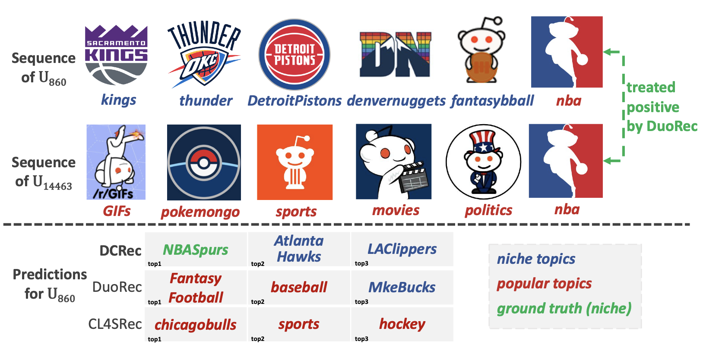
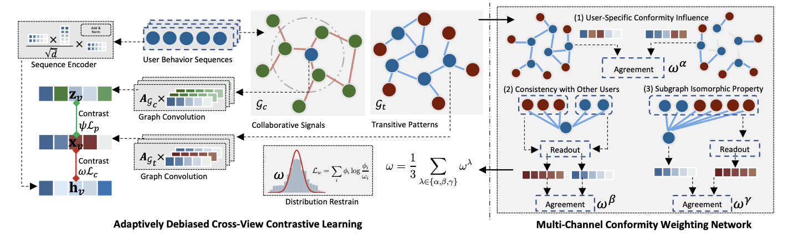
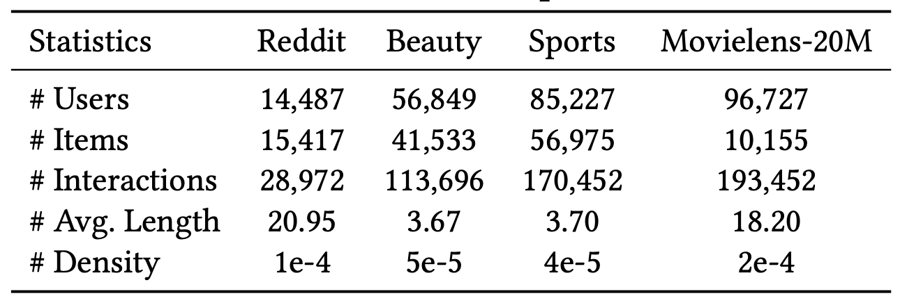

# DCRec

This is the PyTorch implementation for our paper **Debiased Contrastive Learning for Sequential Recommendation**, accpeted by **WWW'23**. The code is built on the [RecBole](https://github.com/RUCAIBox/RecBole) library, implemented by [@yuh-yang](https://github.com/yuh-yang).

* The model implementation is at `recbole/model/sequential_recommender/dcrec.py`
* You can also find our another implementation of DCRec in [SSLRec](https://github.com/HKUDS/SSLRec), which is facilitated with better readability and easy comparison with state-of-the-art SSL sequential recommenders (e.g. BERT4Rec, CL4SRec, DuoRec, etc.) under full-ranking benchmark.

## Citation
```
@inproceedings{dcrec2023,
  author    = {Yang, Yuhao and
               Huang, Chao and
               Xia, Lianghao and
               Huang, Chunzhen and
               Luo, Da and
               Lin, Kangyi},
  title     = {Debiased Contrastive Learning for Sequential Recommendation},
  booktitle = {Proceedings of the ACM Web Conference 2023},
  year      = {2023},
}
```

## Introduction
Currently, researchers have sought to leverage the self-supervised learning (SSL) paradigm by introducing contrastive learning tasks into sequential recommendation models. To incorporate supplementary SSL signals, researchers have explored methods like data augmentations and positive pair identification to improve performance. However, we believe that existing methods have not adequately addressed the inherent popularity bias in both contrastive paradigms. As shown in the given case, current state-of-the-art methods fail to tackle popularity bias introduced in the contrastive learning, thus leading to suboptimal performances compared to our DCRec.



DCRec is a **D**ebiased **C**ontrastive framework for sequential **Rec**ommendation that integrates contrastive learning with conformity and interest disentanglement to address the issue of bias in recommender systems. It distills self-supervision signals for effective augmentation and conducts contrastive learning across view-specific representations. DCRec disentangles user conformity from noisy item interactions using a multi-channel weighting network based on three semantic channels.



## Environments
* Python 3.7
* torch>=1.10.0
* numpy>=1.17.2
* scipy>=1.6.0

## Datasets
Following is the statistics of the datasets we use.



You can find the original data in these links:
* [Reddit](www.kaggle.com/colemaclean/subreddit-interactions/data/)
* [Beauty / Sports](https://jmcauley.ucsd.edu/data/amazon/)
* [Movielens](https://www.kaggle.com/datasets/grouplens/movielens-20m-dataset)

## Run the codes

On Reddit dataset:

`python run_DCRec.py --dataset=reddit `

For other datasets, simply replace "reddit" with the dataset name.

For other baseline models implemented in RecBole, run:

`python run_sequential.py --dataset=[dataset_name] --model=[model_name]`

If you are using the implementation in [SSLRec](https://github.com/HKUDS/SSLRec), use:

`python main.py --model DCRec_seq`

to run DCRec on ml-20m dataset.
### Hyperparameters
Best hyperparameter settings are set in `run_DCRec.py`, from line 243 `# BEST SETTINGS`.